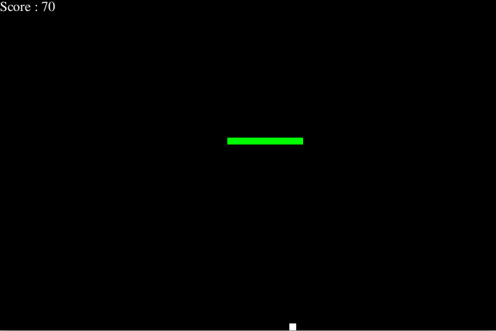

# Snake Game

A simple implementation of the classic Snake game using Python and Pygame. Navigate the snake to eat food and grow, while avoiding collisions with the walls and yourself.

  <!-- Replace with your actual image file name -->

## Table of Contents
- [Features](#features)
- [Installation](#installation)
- [Running the Game](#running-the-game)
- [Controls](#controls)
- [License](#license)
- [RUNNING THE GAME FROM EXECUTABLE](#running-the-game-from-executable)

### Features
- Classic Snake gameplay
- Simple graphics
- High scores tracking (optional)

### Installation

#### Prerequisites
- Python 3.x
- Pygame library

#### Installation and Running Instructions
```bash
# Clone the repository
git clone https://github.com/your-username/snake-game.git
cd snake-game

# Install Pygame
pip install pygame

# Run the game from source
python snake_game.py
```

### Controls
- **Arrow Keys**: Control the direction of the snake (Up, Down, Left, Right)
- **C**: Play again after losing
- **Q**: Quit the game

### License
This project is licensed under the MIT License. See the [LICENSE](LICENSE) file for details.

### RUNNING THE GAME FROM EXECUTABLE
1. Download the executable from the [downloads page](link-to-your-download).
2. Locate the `snake_game.exe` file and double-click to run it. No additional setup is needed.
